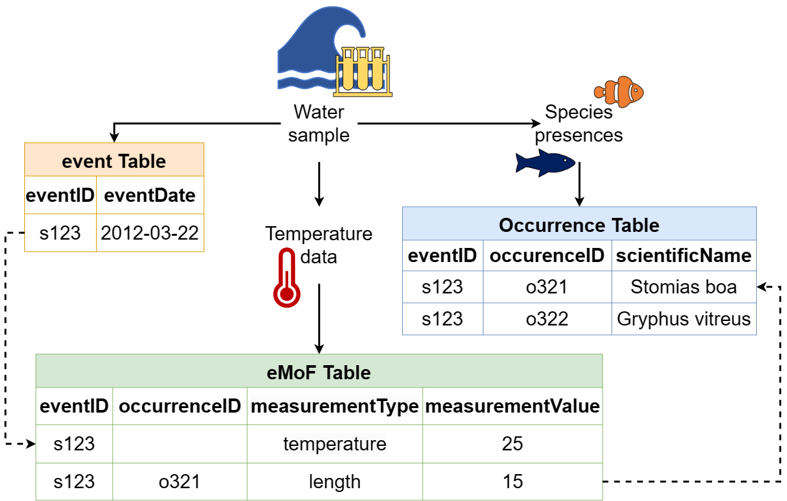

# OBIS-Workshop
Notes from Marine Biological Data Mobilization Workshop 2023

# [Workshop Website](https://ioos.github.io/bio_mobilization_workshop/)

------------------------------------------------------------------------

# Intro to OBIS and Darwin Core

## What is OBIS?

OBIS is a global open-access data and information clearing-house on marine biodiversity for science, conservation and sustainable development.

This workshop focused on mobilizing our data to OBIS by standardizing our data using Darwin Core

## What is Darwin Core?

Darwin Core is a data standard to mobilize and share biodiversity data

Its a global community of data sharing and integration

## How do they interact?

OBIS uses Darwin Core standards and Archives directly to enable standardization of data, as well as exchange and sharing of diverse types of biological observations

------------------------------------------------------------------------

# Taiki's Work From Last Years Workshop

## Our Data and Darwin Core Mapping

Taiki did A LOT of hard work mapping our data outputs to Darwin Core standards and OBIS requirements

-   Using a [Darwin Core Quick Reference Guide](https://dwc.tdwg.org/terms/), Taiki matched up all of our data terms to the DwC terms

-   We should consider adding a `datasetID` (unique identifier) and `datasetName` columns to our event table once we have published the raw data to NCEI

## Data Cleaning

Taiki did all of the data cleaning last year, which included formatting dates to [ISO 8601](https://en.wikipedia.org/wiki/ISO_8601) standards, matching our scientific name abbreviations to [World Register of Marine Species (WoRMS)](https://www.marinespecies.org/), checking coordinates to make sure they are in decimal degrees, and other data prep steps.

-   Here's a snapshot of our event core table

```{r}
CCESTest_Event <- read.csv('Taikis code and datasets\\CCESTest_Event.csv')
head(CCESTest_Event)
```

-   Here's a snapshot of our occurrence extension table

```{r}
CCESTest_Occur <- read.csv('Taikis code and datasets\\CCESTest_Occur.csv')
head(CCESTest_Occur)
```

------------------------------------------------------------------------

# My Work & Ideas

## Cores and Extension Schema

-   Our data follows the Event Core with Occurrence Extension format, meaning we have set events (OBIS events = Drifts) and occurrences that link to those events (OBIS occurrences = PAMPal events)

    -   The data types in these tables are limited by OBIS standards and Darwin Core Terms

    -   If there isn't a Darwin Core Term for one of our data columns, we cannot add it to the event or occurrence table

-   Solution\^: We can consider adding another extension table (extended measurement of fact - eMoF) with additional data that are unconstrained, and would not be restricted by Darwin Core Terms

    -   We would need to try to find our terms unique resource identifiers (URI) to populate a `measurmentTypeID` field, using [NERC Vocab](http://vocab.nerc.ac.uk/collection/P01/current/SDBIOL02/) and the [P01 collection](http://vocab.nerc.ac.uk/search_nvs/P01/?searchstr=&options=identifier,preflabel,altlabel,status_accepted&rbaddfilter=inc&searchstr2=)

        -   If we cannot find NERC or P01 term to match ours, we can [request a new URI](https://github.com/nvs-vocabs/P01) to be made, then others can use that standardized identifier for their data

    -   The extension tables can be linked to the Event Core table or the Occurrence table through `eventID` or `occurrenceID`



## QAQC

### Intro

OBIS performs [quality checks](https://www.ncbi.nlm.nih.gov/pmc/articles/PMC4309024/pdf/bau125.pdf) on all of the data it receives. The following QAQC will ensure your data is prepared and has met the minimum requirements, to limit publishing errors and identify outliers or "faulty" data. Most of the following steps can be completed using [OBIStools functions](https://github.com/iobis/obistools). Data quality checks need to be completed for each table (event, occurrence, and eMoF), however there may be different steps for each table.

### Install and load packages

```{r, eval=FALSE}
#devtools::install_github("iobis/obistools")
#install.packages('Hmisc')
library(devtools)
library(readxl)
library(obistools)
library(Hmisc)
```

### Recommended QAQC Steps to Consider

1.  Check that all the [required Darwin Core terms](https://ioos.github.io/bio_mobilization_workshop/01-introduction/index.html#what-are-the-required-darwin-core-terms-for-publishing-to-obis) and OBIS fields are present and contain the correct information

    1.  `check_fields()`

    2.  [Additional Darwin Core Terms](https://dwc.tdwg.org/terms/)

2.  Make a map from your data to ensure the coordinates are valid and within your expected range

    1.  completed in [`report()` OBIS function](https://github.com/iobis/obistools#data-quality-report)

    2.  You can also use [`plot_map()` or `plot_map_leaflet()`](https://github.com/iobis/obistools#plot-points-on-a-map) for occurrence records

3.  Run basic statistics on each column of numeric data (min, max, mean, std. dev., etc.) to identify potential issues

    1.  Some summary statistics can be found using [`report()` OBIS function](https://github.com/iobis/obistools#data-quality-report)

    2.  You can also use the Hmisc package with the [`describe()` function](https://rdrr.io/cran/Hmisc/man/describe.html)

    3.  If we have a lot of quantitative data, we can use other summary statistic functions to quality check those

4.  Look at unique values of columns containing string entries to identify potential issues (eg. spelling)

5.  Check for uniqueness of `occurrenceID` field

6.  Check for uniqueness of `eventID` for each event, if applicable

    1.  [`eventid <- obistools::check_eventids()`](https://github.com/iobis/obistools#check-eventid-and-parenteventid)

7.  Check that dates are following [ISO-8601](https://en.wikipedia.org/wiki/ISO_8601)

8.  Check that the scientific names is/are valid

    1.  OBIS uses the [World Register of Marine Species (WoRMS)](https://www.marinespecies.org/) as the taxonomic backbone. We need to match our species abbreviations to WoRMS naming

    2.  [`obistools::match_taxa()`](https://github.com/iobis/obistools#taxon-matching) performs interactive taxon matching with WoRMS

### Event Table QAQC Steps

------------------------------------------------------------------------

#### Step 1: Run a diagnostics/summary report for the data quality

```{r, eval=FALSE}
#This will return a diagonistic report including a map of the events and general errors & warnings 
EventReport <- report(eventTable) 
EventReport
#You can also run the Hmisc describe() function for a summary of the data
describe(eventTable)
```

#### Step 2: Check to make sure `eventID` are unique

```{r, eval=FALSE}
eventid <- check_eventids(eventTable)
head(eventid)
```

#### Step 3: Check for proper `eventDate` to ensure they follow ISO 8601 standards

```{r, eval=FALSE}
check_eventdate(eventTable)
```

### Occurrence Table QAQC Steps

------------------------------------------------------------------------

#### Step 1: Run a diagnostics/summary report for the data quality

```{r, eval=FALSE}
#This will check if all OBIS required fields are present in the occurence table
check_fields(occurrenceTable)
#This will return a diagonistic report including a map of the occurrences and general errors & warnings
OccurReport <- report(occurrenceTable) 
OccurReport
#You can also run the Hmisc describe() function for a summary of the data
describe(occurrenceTable)
```

#### Step 2: Check to make sure `occurrenceID` are unique

```{r, eval=FALSE}
#I think this can be completed using describe() function as well. It returns n, missing, and distinct for each column but I imagine we can select one column using $
describe(occurrenceTable$occurrenceID)
```

#### Step 3: Check for proper `eventDate` to ensure they follow ISO 8601 standards

```{r, eval=FALSE}
check_eventdate(occurrenceTable)
```

#### Step 4: Check that the `scientificNameID` are valid

```{r, eval=FALSE}
#OBIS uses 
#Not 100% sure on the best way to do this but heres my idea
#names <- some function to pull out all of the scientificNameID from our occurrence table
match_taxa(names)
#this should return n names, n without matches, n with multiple matches
```

### eMoF Table QAQC Steps

------------------------------------------------------------------------

fill in steps here if we move forward with creating eMoF table (extended measurement or fact extension table)

### OBIS Workshop Example Code

------------------------------------------------------------------------

#### `Hmisc::describe()` Function

```{r eval=FALSE}
# pull in the occurrence file from https://www.sciencebase.gov/catalog/item/53a887f4e4b075096c60cfdd
#url not working
#url <- "https://www.sciencebase.gov/catalog/file/get/53a887f4e4b075096c60cfdd?f=__disk__32%2F24%2F80%2F322480c9bcbad19030e29c9ec5e2caeb54cb4a08&allowOpen=true"
occurrence <- read.csv('53a887f4e4b075096c60cfdd.csv')
head(occurrence,n=1)
Hmisc::describe(occurrence)
```

#### Workshop Exercise

------------------------------------------------------------------------

Code not working, [link to workshop example](https://ioos.github.io/bio_mobilization_workshop/06-qa-qc/index.html)

1.  Run a diagnostics report for the data quality

    ```{r, eval=FALSE}
    trawl_fish <- readxl::read_excel('trawl_fish.xlsx')
    report <- obistools::report(trawl_fish)
    report
    ```

2.  Check to make sure `eventID` are unique

    ```{r, eval=FALSE}
    eventid <- obistools::check_eventids(trawl_fish)
    head(eventid)
    ```

3.  Check for proper `eventDate` to ensure they follow ISO 8601 standards

    ```{r, eval=FALSE}
    eventDate <- obistools::check_eventdate(trawl_fish)
    print(eventDate)
    ```

4.  From the report generated under exercise 1, you can already see that there's measurements made on land. This information can also be gathered by plotting the map separately or using the `check_onland()` or `check_depth()` functions in the [obistools](https://iobis.github.io/obistools/) package.

    ```{r, eval=FALSE}
    depth <- obistools::check_depth(trawl_fish)
    onland <- obistools::check_onland(trawl_fish) # Gives the same output.           
    print(depth) 
    ```

## Metadata and Publishing

### Data Publishing Pipeline


1.  Align our data table with OBIS Requirements and Darwin Core Standards

2.  Upload dataset to an [Integrated Publishing Toolkit (IPT)](https://www.gbif.org/ipt)

    i.  These are developed and maintained by GBIF and its recommended we work with an [OBIS node](https://obis.org/contact/) to publish through their IPT

3.  Develop and add metadata as an Ecological Metadata Language (EML - standardized format)

4.  Publish dataset as a Darwin Core Archive (DwC-A)

5.  Data are pushed to OBIS and GBIF (if wanted) through OBIS IPT

### Requirements for Publishing through OBIS Node

1.  Contact node to ensure our data is a good fit

    i.  There are regional and thematic nodes

    ii. I believe we would work with [OBIS-SEAMAP Node](https://obis.org/node/573654c1-4ce7-4ea2-b2f1-e4d42f8f9c31) (Marine Megavertebrates)

2.  Ensure data follows Darwin Core (DwC) and Ecological Metadata Language (EML) and includes all [required elements](https://manual.obis.org/eml)

    i.  The OBIS Node will help us develop the EML as part of Darwin Core Archive

    ii. We should collect the following information for the EML before sending the data to the node

        1.  Dataset Title

        2.  Abstract

        3.  Data License

        4.  Resource contact(s)

        5.  Resource Creator(s)

        6.  Metadata providers

        7.  Citation

        8.  Not required but highly recommended to link to NCEI data as well

        9.  Additional fields recommended for ease of searchability

## Our Data Hurdles, Next Steps, & Questions

### Determining Range of Uncertainty

-   No clear solution found in workshop

-   Presenters said do what works best for us, but include documentation of how we determined the value

-   Liz Ferguson is using estimates from literature for each species/group

-   SanctSound is planning to calculate values based on frequency ranges

### Important PAM Specific Fields to Include

-   eMoF extension tables

-   Consider including call type, recording method, sampling rate, and other quantitative and qualitative data relating to OBIS events and occurrences

-   If any of this information is consistent for an entire project (i.e. we only upload drifting recorder data) we can include that in the metadata/dataset description

### What Is An Event (OBIS Occurrence) For Baleen Whales

-   No clear consensus from workshop presenters

-   Hourly bins do fit in the OBIS model but they said using wav files would be appropriate as well

-   Again, we can choose what works best for us and then document our methods using the `identificationRemarks` field

-   We can also use different event types in the same dataset (ex. hourly bins for Blue whales and wav files for Minkes)

    -   Specify occurrence type using `occurrenceRemarks` field

-   We can also link to specific wav files if we have those stored somewhere using the `associatedMedia` field

### Next Steps

-   

### Questions?
